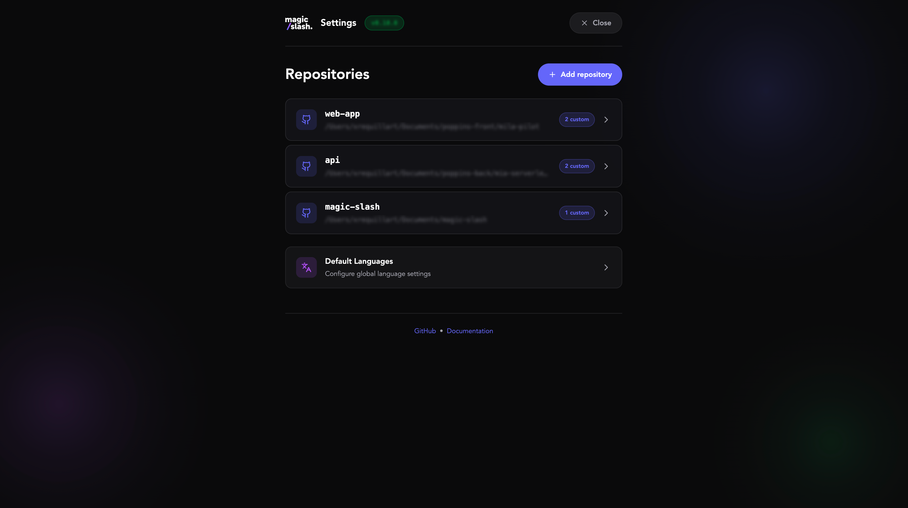

<p align="center">
  
</p>

<p align="center">
  3 skills for Claude Code that automate the entire development cycle.
</p>

<p align="center">
  <a href="https://github.com/xrequillart/magic-slash/actions/workflows/ci.yml">
    
  </a>
  <a href="https://github.com/xrequillart/magic-slash/releases">
    
  </a>
  <a href="LICENSE">
    
  </a>
  <a href="https://github.com/xrequillart/magic-slash/stargazers">
    
  </a>
</p>

## Skills

| Skill     | Description                                       |
| --------- | ------------------------------------------------- |
| `/start`  | Start a task from a Jira ticket or GitHub issue   |
| `/commit` | Create an atomic commit with conventional message |
| `/done`   | Push, create PR and update Jira                   |

You can also invoke skills using natural language:

- "démarre PROJ-123" or "work on PROJ-123" → `/start`
- "je suis prêt à committer" or "ready to commit" → `/commit`
- "on peut créer la PR" or "create the PR" → `/done`

## Installation

```bash
curl -fsSL https://magic-slash.io/install.sh | bash
```

### Prerequisites

- [Claude Code](https://claude.ai/download)
- Node.js
- Git
- jq

### What the script does

1. Configures Atlassian MCP (prompts for OAuth authentication)
2. Configures GitHub MCP (prompts for your token)
3. Configures your repositories (1 to N repos with optional keywords for smart detection)
4. Installs the 3 skills

## Usage

### /start - Start a task

```bash
/start PROJ-1234    # Jira ticket
/start 42           # GitHub issue
/start #42          # GitHub issue (with #)
```

1. Detects the ticket type (Jira or GitHub) based on format
2. Fetches ticket/issue details (title, description, labels)
3. Analyzes the scope using keyword-based scoring to select relevant repositories
4. Creates Git worktrees automatically for selected repos
5. Generates an agent context to start coding

**Jira example (single repo detected):**

```text
> /start PROJ-42

Source: Jira
Ticket: PROJ-42 - Add API endpoint for users
Type: Feature
Scope: api (score: 15) - matched keywords: "backend", "api"

Worktree created:
✓ /projects/my-api-PROJ-42

Context:
You need to implement the new API endpoint for users...
```

**Jira example (multiple repos detected):**

```text
> /start PROJ-42

Source: Jira
Ticket: PROJ-42 - Add pagination on /users
Type: Feature

This ticket seems to concern multiple repositories:
1. api (score: 15) - matched keywords: "backend", "api"
2. web (score: 10) - matched keywords: "frontend"

Which one do you want to use? (1, 2, or 'all')
> all

Worktrees created:
✓ /projects/my-api-PROJ-42
✓ /projects/my-web-PROJ-42
```

### /commit - Create a commit

```bash
/commit
```

1. Stage all changes
2. Analyze the diff
3. Evaluate if changes should be split into multiple commits
4. Generate a conventional message (respects per-repo settings)
5. Auto-fix pre-commit hook errors (lint, format, etc.)
6. Create the commit

**Format examples:**

| Format       | Example                                           |
| ------------ | ------------------------------------------------- |
| conventional | `feat: add JWT token refresh mechanism`           |
| angular      | `feat(auth): add JWT token refresh mechanism`     |
| gitmoji      | `✨ add JWT token refresh mechanism`              |

**With ticket ID (if enabled):**

```text
[PROJ-123] feat(auth): add JWT token refresh mechanism
```

**Multi-repo support:** If you're in a worktree associated with a ticket that spans multiple repos,
`/commit` will detect all related worktrees and commit changes in each one.

### /done - Finalize the task

```bash
/done
```

1. Push the branch to origin
2. Create a Pull Request (via GitHub MCP)
   - Uses your project's PR template if one exists
   - Auto-links Jira/GitHub tickets in description (by default)
3. Extract ticket ID from branch name
4. Update Jira ticket → "To be reviewed"
5. Add comment with PR link on Jira (by default)

**Example:**

```text
✅ Task completed!

📌 Branch   : feature/PROJ-42
🔗 PR       : https://github.com/org/repo/pull/42
🎫 Ticket   : PROJ-42 → To be reviewed

Next steps:
1. Request a review from your colleagues
2. Wait for approval and CI checks
3. Merge the PR once approved
```

## Configuration

### Web UI

Run `magic-slash` to open the configuration web interface:

```bash
magic-slash
```

This launches a local web server and opens your browser to configure:

- **Repositories**: Add, edit, or remove repositories with their paths and keywords
- **Per-repository settings**: Customize commit format, PR behavior, and languages for each repo
- **Global defaults**: Set default languages for all repositories

<p align="center">
  
</p>

### Files

| File                                | Description                            |
| ----------------------------------- | -------------------------------------- |
| `~/.claude/settings.json`           | Atlassian & GitHub MCP configuration   |
| `~/.config/magic-slash/config.json` | Repository paths, keywords, settings   |
| `~/.local/bin/magic-slash`          | CLI command to launch web UI           |
| `~/.claude/skills/magic-slash/`     | Installed skills (start, commit, done) |

### Configuration schema

```json
{
  "version": "0.11.1",
  "repositories": {
    "api": {
      "path": "/Users/dev/projects/my-api",
      "keywords": ["backend", "api", "server"],
      "languages": {
        "commit": "en",
        "pullRequest": "fr"
      },
      "commit": {
        "style": "single-line",
        "format": "angular",
        "coAuthor": false,
        "includeTicketId": true
      },
      "pullRequest": {
        "autoLinkTickets": true
      },
      "issues": {
        "commentOnPR": true
      }
    },
    "web": {
      "path": "/Users/dev/projects/my-web",
      "keywords": ["frontend", "ui", "react"]
    }
  },
  "languages": {
    "commit": "en",
    "pullRequest": "en",
    "jiraComment": "en",
    "discussion": "en"
  }
}
```

### Repository settings

Each repository can have its own settings that override global defaults:

#### Languages

| Setting       | Description                              | Default |
| ------------- | ---------------------------------------- | ------- |
| `commit`      | Language for commit messages             | `en`    |
| `pullRequest` | Language for PR title and description    | `en`    |
| `jiraComment` | Language for Jira comments               | `en`    |
| `discussion`  | Language for Claude Code interactions    | `en`    |

#### Commit settings

| Setting           | Description                                      | Default       |
| ----------------- | ------------------------------------------------ | ------------- |
| `style`           | `single-line` or `multi-line` (with body)        | `single-line` |
| `format`          | `conventional`, `angular`, `gitmoji`, or `none`  | `angular`     |
| `coAuthor`        | Add Claude as co-author in commits               | `false`       |
| `includeTicketId` | Add ticket ID from branch name in commit message | `false`       |

#### Pull Request settings

| Setting           | Description                                      | Default |
| ----------------- | ------------------------------------------------ | ------- |
| `autoLinkTickets` | Add Jira/GitHub ticket links in PR description   | `true`  |

#### Issues settings

| Setting       | Description                                    | Default |
| ------------- | ---------------------------------------------- | ------- |
| `commentOnPR` | Add comment with PR link when creating the PR  | `true`  |

### Keywords

Keywords are used for smart repository selection when starting a task:

- When a Jira ticket has labels/components matching keywords → +10 points
- When keywords are found in the ticket title → +5 points
- When keywords are found in the description → +2 points
- If no keywords are specified, the repository name is used as default

## Project structure

```text
magic-slash/
├── .github/
│   ├── ISSUE_TEMPLATE/   # Bug report & feature request templates
│   ├── workflows/        # CI and release workflows
│   ├── PULL_REQUEST_TEMPLATE.md
│   └── dependabot.yml
├── skills/
│   ├── commit/SKILL.md   # Skill /commit
│   ├── start/SKILL.md    # Skill /start
│   └── done/SKILL.md     # Skill /done
├── web-ui/               # Configuration web interface
│   ├── server.js         # Express server
│   ├── package.json      # Dependencies
│   ├── lib/              # Backend utilities
│   └── public/           # Frontend (HTML, CSS, JS)
├── docs/                 # Landing page (GitHub Pages)
│   ├── index.html        # Main page
│   ├── logo.svg          # Logo (vector)
│   ├── logo.png          # Logo (raster)
│   ├── fonts/            # Custom fonts (Avenir)
│   └── CNAME             # Custom domain config
├── install/
│   ├── install.sh        # Installation script
│   ├── uninstall.sh      # Uninstallation script
│   └── magic-slash       # CLI script (launches web UI)
├── CHANGELOG.md          # Version history
├── CODE_OF_CONDUCT.md    # Community guidelines
├── CONTRIBUTING.md       # Contribution guide
├── LICENSE               # MIT License
├── README.md             # This file
├── SECURITY.md           # Security policy
├── commitlint.config.js  # Commit message linting
└── package.json          # Dev dependencies (linters)
```

## Contributing

Contributions are welcome! Please read our contributing guidelines before getting started.

- [Contributing Guide](CONTRIBUTING.md) - How to contribute to the project
- [Code of Conduct](CODE_OF_CONDUCT.md) - Our community standards
- [Security Policy](SECURITY.md) - How to report security vulnerabilities

### Quick Start for Contributors

```bash
# Clone the repository
git clone https://github.com/xrequillart/magic-slash.git
cd magic-slash

# Install dev dependencies
npm install

# Install yamllint (required for YAML linting)
pip install yamllint

# Run linters
npm run lint

# Test the web UI locally
cd web-ui && npm install && npm start
```

## Acknowledgments

Magic Slash is built with and for:

- [Claude Code](https://claude.ai/download) - AI-powered coding assistant
- [Atlassian MCP](https://mcp.atlassian.com) - Jira and Confluence integration
- [GitHub MCP](https://github.com/modelcontextprotocol/server-github) - GitHub integration
- [Conventional Commits](https://www.conventionalcommits.org/) - Commit message standard

## License

MIT - See [LICENSE](LICENSE) for details.

---

<p align="center">
  Made with love by <a href="https://github.com/xrequillart">Xrequillart</a>
</p>
