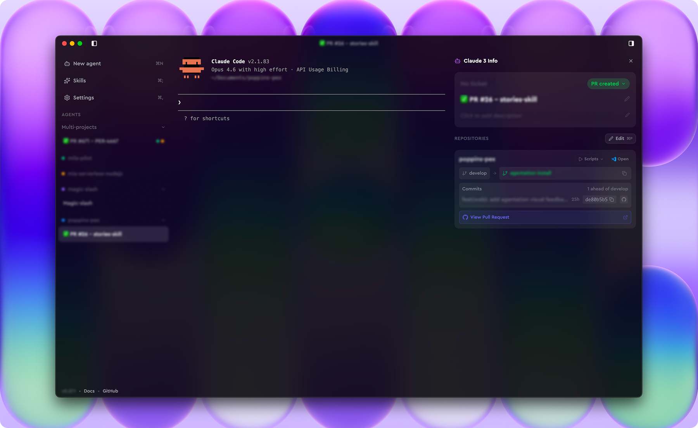

<p align="center">
  <picture>
    <source media="(prefers-color-scheme: dark)" srcset="docs/logo-readme-dark.svg">
    <source media="(prefers-color-scheme: light)" srcset="docs/logo-readme-light.svg">
    
  </picture>
</p>

<p align="center">
  Desktop app with 7 Claude Code skills to automate your entire dev cycle — from Jira ticket to merged PR.
</p>

<p align="center">
  
</p>

<p align="center">
  <a href="https://github.com/xrequillart/magic-slash/actions/workflows/ci.yml">
    
  </a>
  <a href="https://github.com/xrequillart/magic-slash/releases">
    
  </a>
  <a href="LICENSE">
    
  </a>
  <a href="https://github.com/xrequillart/magic-slash/stargazers">
    
  </a>
</p>

## Skills

| Skill             | Description                                       |
| ----------------- | ------------------------------------------------- |
| `/magic:start`    | Start a task from a Jira ticket or GitHub issue   |
| `/magic:continue` | Resume work on an existing ticket                 |
| `/magic:commit`   | Create an atomic commit with conventional message |
| `/magic:pr`       | Push, create PR and update Jira                   |
| `/magic:review`   | Review a Pull Request (self or external)          |
| `/magic:resolve`  | Address review comments and force-push fixes      |
| `/magic:done`     | Finalize after PR merge (transition Jira to Done) |

> Type `/magic:` to quickly find all commands.

You can also invoke skills using natural language:

- "démarre PROJ-123" or "work on PROJ-123" → `/magic:start`
- "je reprends PROJ-123" or "continue PROJ-123" → `/magic:continue`
- "je suis prêt à committer" or "ready to commit" → `/magic:commit`
- "on peut créer la PR" or "create the PR" → `/magic:pr`
- "regarde la PR" or "review my PR" → `/magic:review`
- "corriger les commentaires" or "fix review comments" → `/magic:resolve`
- "la PR est mergée" or "the PR is merged" → `/magic:done`

## Installation

```bash
curl -fsSL https://magic-slash.io/install.sh | bash
```

### Prerequisites

- [Claude Code](https://claude.ai/download)
- Node.js 20+ (see `.nvmrc`)
- Git
- jq

### What the script does

1. Configures Atlassian MCP (prompts for OAuth authentication)
2. Configures GitHub MCP (prompts for your token)
3. Configures your repositories (1 to N repos with optional keywords for smart detection)
4. Installs the 7 skills

## Usage

### /magic:start - Start a task

```bash
/magic:start PROJ-1234    # Jira ticket
/magic:start 42           # GitHub issue
/magic:start #42          # GitHub issue (with #)
```

1. Detects the ticket type (Jira or GitHub) based on format
2. Fetches ticket/issue details (title, description, labels)
3. Analyzes the scope using keyword-based scoring to select relevant repositories
4. Creates Git worktrees automatically for selected repos
5. Generates an agent context to start coding

**Jira example (single repo detected):**

```text
> /magic:start PROJ-42

Source: Jira
Ticket: PROJ-42 - Add API endpoint for users
Type: Feature
Scope: api (score: 15) - matched keywords: "backend", "api"

Worktree created:
✓ /projects/my-api-PROJ-42

Context:
You need to implement the new API endpoint for users...
```

**Jira example (multiple repos detected):**

```text
> /magic:start PROJ-42

Source: Jira
Ticket: PROJ-42 - Add pagination on /users
Type: Feature

This ticket seems to concern multiple repositories:
1. api (score: 15) - matched keywords: "backend", "api"
2. web (score: 10) - matched keywords: "frontend"

Which one do you want to use? (1, 2, or 'all')
> all

Worktrees created:
✓ /projects/my-api-PROJ-42
✓ /projects/my-web-PROJ-42
```

### /magic:commit - Create a commit

```bash
/magic:commit
```

1. Stage all changes
2. Analyze the diff
3. Evaluate if changes should be split into multiple commits
4. Generate a conventional message (respects per-repo settings)
5. Auto-fix pre-commit hook errors (lint, format, etc.)
6. Create the commit

**Format examples:**

| Format       | Example                                       |
| ------------ | --------------------------------------------- |
| conventional | `feat: add JWT token refresh mechanism`       |
| angular      | `feat(auth): add JWT token refresh mechanism` |
| gitmoji      | `:sparkles: add JWT token refresh mechanism`  |

**With ticket ID (if enabled):**

```text
[PROJ-123] feat(auth): add JWT token refresh mechanism
```

**Multi-repo support:** If you're in a worktree associated with a ticket that spans multiple repos,
`/magic:commit` will detect all related worktrees and commit changes in each one.

### /magic:pr - Push and create a Pull Request

```bash
/magic:pr
```

1. Push the branch to origin
2. Create a Pull Request (via GitHub MCP)
   - Uses your project's PR template if one exists
   - Auto-links Jira/GitHub tickets in description (by default)
3. Extract ticket ID from branch name
4. Update Jira ticket → "To be reviewed"
5. Add comment with PR link on Jira (by default)

**Multi-repo support:** If you're in a worktree associated with a ticket that spans multiple repos,
`/magic:pr` will push and create PRs for each one.

**Example:**

```text
📌 Branch   : feature/PROJ-42
🔗 PR       : https://github.com/org/repo/pull/42
🎫 Ticket   : PROJ-42 → To be reviewed

Next steps:
1. Request a review from your colleagues
2. Wait for approval and CI checks
3. Merge the PR once approved
```

### /magic:review - Review a Pull Request

```bash
/magic:review          # Review the PR for the current branch
/magic:review PROJ-42  # Review a specific ticket's PR
```

1. Detect the PR associated with the current branch (or a given ticket)
2. Determine if this is a self-review or an external review
3. Fetch the PR diff and changed files
4. Analyze each file for issues, suggestions, and good practices
5. Submit the review on GitHub with categorized inline comments (Blocking / Suggestion / Praise)

> **Note:** This skill is read-only — it does not modify any files.

### /magic:resolve - Address review feedback

```bash
/magic:resolve          # Fix comments on the current branch's PR
/magic:resolve PROJ-42  # Fix comments for a specific ticket's PR
```

1. Retrieve unresolved review comments from the PR
2. Analyze each comment and determine required changes
3. Apply fixes to the codebase
4. Amend or create fixup commits as appropriate
5. Force-push with `--force-with-lease`

### /magic:done - Finalize after merge

```bash
/magic:done
```

1. Verify the PR has been merged
2. Transition the Jira ticket to "Done"
3. Add a final comment on Jira with a summary
4. Update task status in the Desktop app

**Example:**

```text
✅ Task finalized!

🎫 Ticket   : PROJ-42 → Done
🔗 PR       : https://github.com/org/repo/pull/42 (merged)
```

## Desktop App

Magic Slash ships a native desktop application built with Electron, featuring integrated Claude Code terminals, project management sidebar, and agent tracking. The app checks for updates automatically on launch.

```bash
# Install desktop dependencies
npm run desktop:install

# Run in development mode
npm run desktop

# Build for production
npm run desktop:build

# Package for macOS
npm run desktop:package
```

## Configuration

### Files

| File                                | Description                           |
| ----------------------------------- | ------------------------------------- |
| `~/.claude/settings.json`           | Atlassian & GitHub MCP configuration  |
| `~/.config/magic-slash/config.json` | Repository paths, keywords, settings  |
| `~/.local/bin/magic-slash`          | CLI command to launch the desktop app |
| `~/.claude/skills/magic-slash/`     | Installed skills (all 7 skills)       |

### Configuration schema

```json
{
  "version": "0.39.7",
  "repositories": {
    "api": {
      "path": "/Users/dev/projects/my-api",
      "keywords": ["backend", "api", "server"],
      "color": "#3B82F6",
      "languages": {
        "commit": "en",
        "pullRequest": "fr",
        "jiraComment": "en",
        "discussion": "en"
      },
      "commit": {
        "style": "single-line",
        "format": "angular",
        "coAuthor": true,
        "includeTicketId": true
      },
      "resolve": {
        "commitMode": "new",
        "useCommitConfig": true,
        "replyToComments": true,
        "replyLanguage": "en"
      },
      "pullRequest": {
        "autoLinkTickets": true
      },
      "issues": {
        "commentOnPR": true,
        "jiraUrl": "",
        "githubIssuesUrl": ""
      },
      "branches": {
        "development": "develop"
      },
      "worktreeFiles": [".env", ".env.local"]
    },
    "web": {
      "path": "/Users/dev/projects/my-web",
      "keywords": ["frontend", "ui", "react"]
    }
  }
}
```

> The `version` field is managed automatically by the installer.

### Repository settings

Each repository can be independently configured:

#### Languages

| Setting       | Description                           | Default |
| ------------- | ------------------------------------- | ------- |
| `commit`      | Language for commit messages          | `en`    |
| `pullRequest` | Language for PR title and description | `en`    |
| `jiraComment` | Language for Jira comments            | `en`    |
| `discussion`  | Language for Claude Code interactions | `en`    |

> Supported languages: `en` (English) and `fr` (French).

#### Commit settings

| Setting           | Description                                      | Default       |
| ----------------- | ------------------------------------------------ | ------------- |
| `style`           | `single-line` or `multi-line` (with body)        | `single-line` |
| `format`          | `conventional`, `angular`, `gitmoji`, or `none`  | `angular`     |
| `coAuthor`        | Add Claude as co-author in commits               | `true`        |
| `includeTicketId` | Add ticket ID from branch name in commit message | `true`        |

#### Resolve settings

| Setting           | Description                                               | Default |
| ----------------- | --------------------------------------------------------- | ------- |
| `commitMode`      | `new` (new commit + push) or `amend` (amend + force-push) | `new`   |
| `useCommitConfig` | Inherit format/style from commit settings                 | `true`  |
| `replyToComments` | Reply in-thread on GitHub for each resolved comment       | `true`  |
| `replyLanguage`   | Language for comment replies (`en`, `fr`)                 | `en`    |

#### Pull Request settings

| Setting           | Description                                    | Default |
| ----------------- | ---------------------------------------------- | ------- |
| `autoLinkTickets` | Add Jira/GitHub ticket links in PR description | `true`  |

#### Issues settings

| Setting           | Description                                   | Default |
| ----------------- | --------------------------------------------- | ------- |
| `commentOnPR`     | Add comment with PR link when creating the PR | `true`  |
| `jiraUrl`         | Base URL for Jira instance                    | `""`    |
| `githubIssuesUrl` | URL for GitHub Issues                         | `""`    |

#### Branches settings

| Setting       | Description                                                | Default |
| ------------- | ---------------------------------------------------------- | ------- |
| `development` | Base branch for worktrees and PRs (e.g. `develop`, `main`) | `""`    |

> If `development` is empty, the skill prompts the user to specify the base branch.

#### Worktree files

| Setting         | Description                                                   | Default |
| --------------- | ------------------------------------------------------------- | ------- |
| `worktreeFiles` | Files to auto-copy from main repo to worktrees (e.g., `.env`) | `[]`    |

> When creating a worktree, Magic Slash copies these files from the main repository. If not configured, it auto-detects common untracked files and offers to save them for future use.

### Keywords

Keywords are used for smart repository selection when starting a task:

- When a Jira ticket has labels/components matching keywords → +10 points
- When keywords are found in the ticket title → +5 points
- When keywords are found in the description → +2 points
- If no keywords are specified, the repository name is used as default

## Project structure

```text
magic-slash/
├── .github/
│   ├── ISSUE_TEMPLATE/   # Bug report, feature request templates & config
│   ├── workflows/        # CI and release workflows
│   ├── PULL_REQUEST_TEMPLATE.md
│   └── dependabot.yml
├── desktop/               # Electron desktop app
│   ├── src/
│   │   ├── main/          # Main process (config, PTY, IPC)
│   │   ├── preload/       # Secure bridge
│   │   └── renderer/      # React UI (pages, components, hooks)
│   ├── resources/         # App icons & logo
│   └── package.json
├── skills/                        # Claude Code skills (7 skills)
│   ├── magic-start/              # Start a task
│   │   ├── SKILL.md
│   │   └── references/           # Messages, glossary, API docs, templates
│   ├── magic-continue/           # Resume work on a ticket
│   │   ├── SKILL.md
│   │   └── references/
│   ├── magic-commit/             # Create atomic commits
│   │   ├── SKILL.md
│   │   └── references/
│   ├── magic-pr/                 # Push and create PR
│   │   ├── SKILL.md
│   │   └── references/
│   ├── magic-review/SKILL.md     # Review a Pull Request
│   ├── magic-resolve/            # Address review feedback
│   │   ├── SKILL.md
│   │   └── references/
│   ├── magic-done/SKILL.md       # Finalize after merge
│   └── evals/                    # Eval set and results
├── docs/                 # Landing page (GitHub Pages)
│   ├── index.html        # Main page
│   ├── documentation.html # Documentation page
│   ├── logo.svg          # Logo (vector)
│   ├── fonts/            # Custom fonts (Avenir, CeraPro)
│   └── CNAME             # Custom domain config
├── install/
│   ├── install.sh        # Installation script
│   ├── uninstall.sh      # Uninstallation script
│   └── magic-slash       # CLI script (launches Desktop app)
├── CHANGELOG.md          # Version history
├── CODE_OF_CONDUCT.md    # Community guidelines
├── CONTRIBUTING.md       # Contribution guide
├── LICENSE               # MIT License
├── README.md             # This file
├── SECURITY.md           # Security policy
├── commitlint.config.js  # Commit message linting
├── eslint.config.mjs     # ESLint configuration
├── vitest.config.ts      # Test configuration
└── package.json          # Dev dependencies (linters, tests)
```

## Contributing

Contributions are welcome! Please read our contributing guidelines before getting started.

- [Contributing Guide](CONTRIBUTING.md) - How to contribute to the project
- [Code of Conduct](CODE_OF_CONDUCT.md) - Our community standards
- [Security Policy](SECURITY.md) - How to report security vulnerabilities

### Quick Start for Contributors

```bash
# Clone the repository
git clone https://github.com/xrequillart/magic-slash.git
cd magic-slash

# Install dev dependencies
npm install

# Install yamllint (required for YAML linting)
pip install yamllint    # or: brew install yamllint

# Run linters
npm run lint

# Run tests
npm test

# Install desktop dependencies and run in dev mode
npm run desktop:install
npm run desktop
```

## Acknowledgments

Magic Slash is built with and for:

- [Claude Code](https://claude.ai/download) - AI-powered coding assistant
- [Atlassian MCP](https://mcp.atlassian.com) - Jira and Confluence integration
- [GitHub MCP](https://github.com/modelcontextprotocol/server-github) - GitHub integration
- [Conventional Commits](https://www.conventionalcommits.org/) - Commit message standard
- [Electron](https://www.electronjs.org/) - Desktop application framework
- [React](https://react.dev/) - UI library for desktop app
- [Tailwind CSS](https://tailwindcss.com/) - Utility-first CSS framework

## License

MIT - See [LICENSE](LICENSE) for details.

---

<p align="center">
  Made with love by <a href="https://github.com/xrequillart">Xrequillart</a>
</p>
